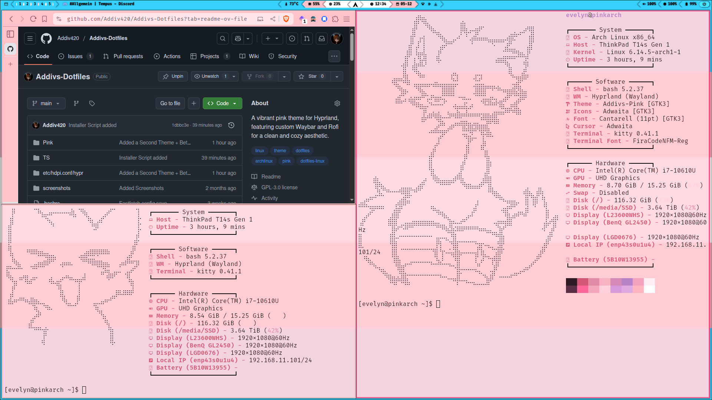

# Evelyn's Dotfiles – Hyprland Themes

A collection of custom desktop themes for Hyprland on Arch Linux.  
Each theme is crafted with care to provide a visually cohesive, functional, and stylish Linux experience.  
Whether you prefer soft pinks or other aesthetic vibes – there's something for you here.

---

## 📸 Previews

Each theme view is visible in the corresponding section below.

---

## 🎨 Themes

<details>
<summary><strong>Theme 1 – Evelyn's Pink</strong></summary>

A beautifully soft and fully pink desktop theme.  
Crafted for elegance, readability, and a cohesive feminine look – this setup brings a cute yet functional aesthetic to your Linux experience.

### 📷 Screenshots

  
*Active Desktop with Evelyn's Pink*

  
*Rofi menu with fully themed pink style*

### ✨ Features

- Fully themed **Hyprland** desktop
- Custom **Waybar** (based on Mechabar) with pink styling
- Custom **Rofi** (based on adi1090x configs) to match the overall aesthetic
- Cohesive pink tones across all elements
- Clean layout, ideal for daily use and customization

### 📁 Theme Files

All files for this theme follow the `*1.*` naming scheme, e.g. `hyprland.conf1`, `waybar1.json`.

</details>

<details>
<summary><strong>🌙 Theme 2 – Evelyn's Trans</strong></summary>

### 📷 Screenshots

  
*Active Desktop with Theme 2*

  
*Rofi menu styled for Theme 2*

### ✨ Features

- Customized **Hyprland**, **Waybar**, and **Rofi** config
- Color scheme and layout optimized for the theme's vibe
- Clean and modular setup, easily adjustable

### 📁 Theme Files

All files for this theme follow the `*2.*` naming scheme, e.g. `hyprland.conf2`, `waybar2.json`.

</details>

---

## 🔧 Installation

```bash
# Clone the repository
git clone https://github.com/Evelynox/Evelyns-Dotfiles
cd Evelyns-Dotfiles
