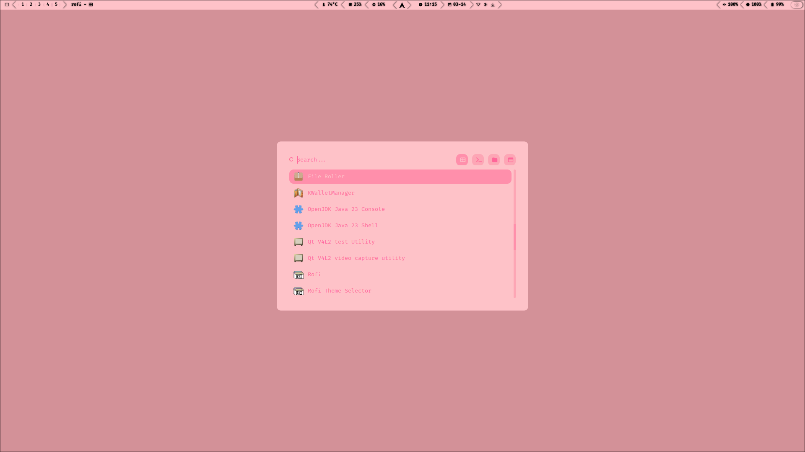

# Addiv's Pink – Hyprland Theme

A beautifully soft and fully pink desktop theme for Hyprland on Arch Linux.  
Crafted for elegance, readability, and a cohesive feminine look – this setup brings a cute yet functional aesthetic to your Linux experience.

---

## 📸 Preview

  
*Active Desktop with Addiv's Pink*

  
*Rofi menu with fully themed pink style*

---

## ✨ Features

- Fully themed **Hyprland** desktop
- Custom **Waybar** (based on Mechabar) with pink styling
- Custom **Rofi** (based on adi1090x configs) to match the overall aesthetic
- Cohesive pink tones across all elements
- Clean layout, ideal for daily use and customization

---

## 🔧 Installation

```bash
# Clone the repository
git clone https://github.com/Addiv420/Addivs-Pink
cd Addivs-Pink
```

Follow the instructions inside the repo to apply the config for:
- hyprland (window manager)
- waybar (statusbar)
- rofi (app launcher)

<summary>Optional, but recommended</summary>
- ttf-firacode-nerd    #main font
- hyprshot (taking screenshots)
hyprpaper         #wallpaper
hyprlock       #screen locker
hypridle       #screen idler
waybar            #statusbarw
thunar            #file manager
tumbler           #thunar media preview
ffmpegthumbnailer #thunar multimedia thumbnails
fastfetch-git     #terminal decoration
noto-fonts-emoji  #emoji font
rofimoji       #emoji picker

> ⚠️ Prerequisites: Arch Linux (or based), Hyprland, Waybar, Rofi, git

---

## 📃 License

[GNU General Public License v3.0](LICENSE.md)

---

Made with 💗 by Addiv
